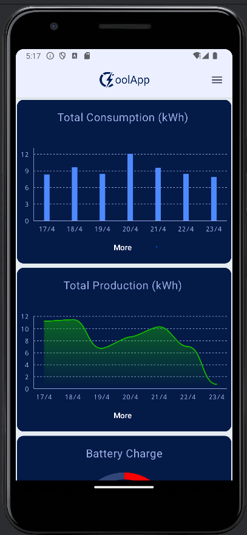
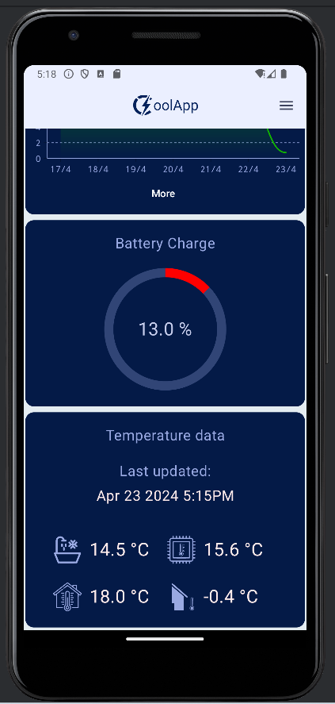
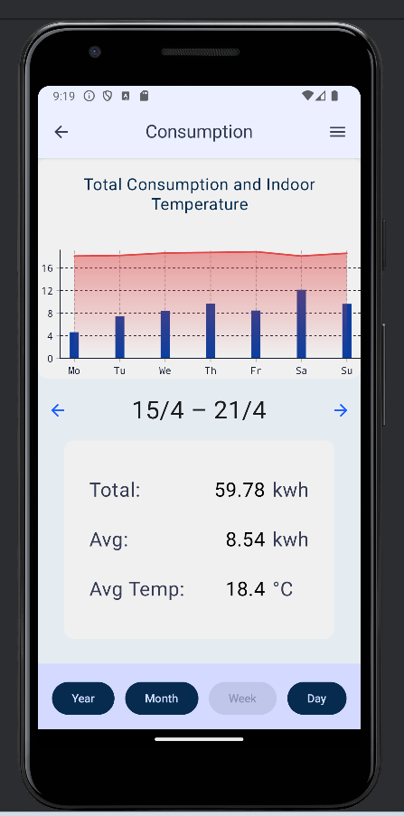
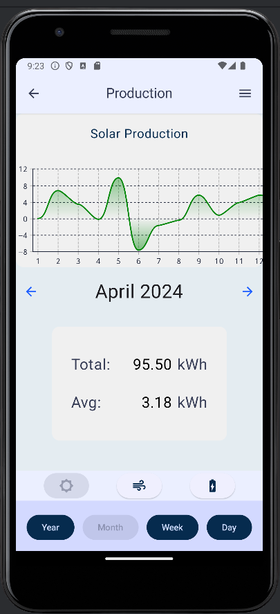
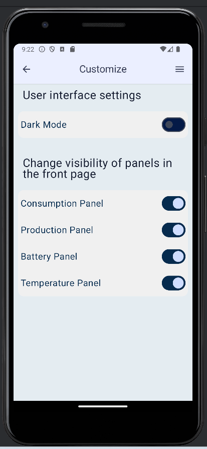
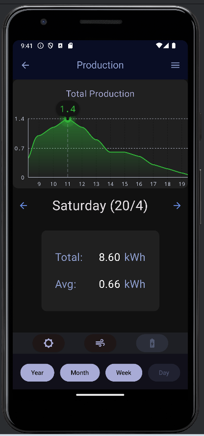

# Team 1 CoolBox mobiiliprojekti App

## Android-mobiilisovellus älytalon energiankulutuksen ja -tuotannon seurantaan:

 

## Repon kopiointi
- Clone with HTTPS
- Android studiossa New -> Project from version control

## Code formatterin vaihto
- Paina editorissa CTRL + ALT + S
- Navigoi Editor -> Code Style -> Kotlin
- Klikkaa Scheme fieldin asetukset ikonia
- Paina Import Scheme...
- Etsi CoolBox-mobiiliprojecti-app.xml paikallisen repositorion juuresta ja paina Ok.
- Paina Apply ja Ok

+ Käytä formatteria CTRL + ALT + L
